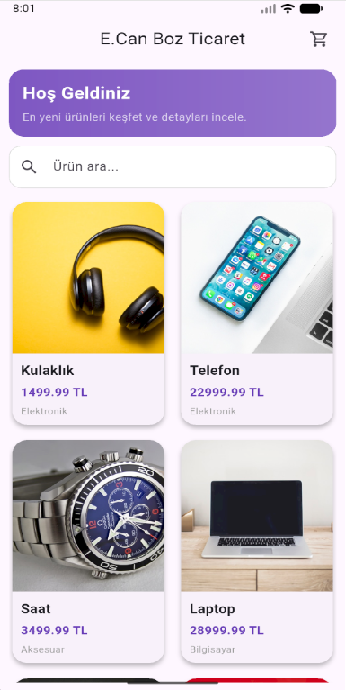
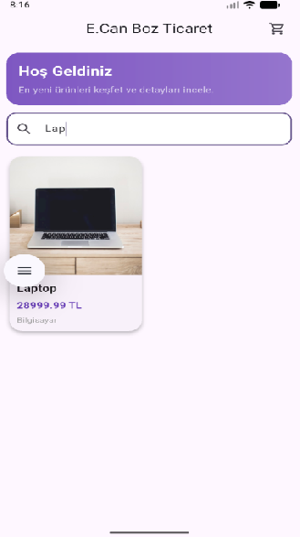
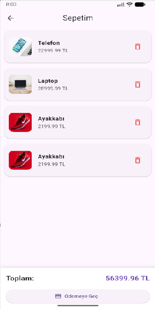

# Mini Katalog Uygulaması

Mini Katalog Uygulaması, **Flutter** kullanılarak geliştirilmiş, kullanıcıların ürünleri keşfetmesine ve alışveriş deneyimi simülasyonu yapmasına olanak tanıyan bir mobil katalog uygulamasıdır.

Bu proje, Flutter'ın temel yapı taşlarını ve modern mobil geliştirme pratiklerini uygulamalı olarak öğrenmek amacıyla geliştirilmiştir.

# Ekran Görüntüleri

## Ana Ekran / Ürün Detay Sayfası / Sepet Ekranı

  

## Proje İçeriği ve Öğrenim Kazanımları

Proje kapsamında aşağıdaki temel Flutter yetkinlikleri uygulanmıştır:

- **Widget Yapısı:** Composable ve tekrar kullanılabilir arayüz bileşenleri.
- **Navigator:** Sayfalar arası geçiş ve veri aktarımı yönetimi.
- **GridView:** Dinamik ve performanslı liste yapıları.
- **State Management:** `StatefulWidget` ile temel durum yönetimi.
- **Data Modeling:** Dart sınıfları ile veri modelleri oluşturma.

## Kullanılan Teknolojiler

- **Framework:** Flutter
- **Dil:** Dart
- **Arayüz:** Material Design
- **Yapılar:** GridView, Navigator, StatefulWidget

### Sürüm Bilgileri

- **Flutter:** 3.41.4
- **Dart:** 3.11.1

---

## Özellikler

- **Ürün Listeleme:** Ana ekranda şık kart tasarımları ve GridView ile ürün sunumu.
- **Ürün Arama:** Arama kutusu üzerinden anlık ürün filtreleme.
- **Detay Sayfası:** Ürün görseli, fiyat, kategori ve detaylı açıklamaların gösterimi.
- **Sepet Yönetimi:** \* Ürün ekleme ve çıkarma.
- Anlık toplam fiyat hesaplama.

- **Demo Ödeme:** "Ödemeye Geç" butonu ile başarılı bir ödeme simülasyonu.

---

## Klasör Yapısı

```text
lib
│
├── main.dart             # Uygulama giriş noktası
│
├── models
│   └── product.dart      # Ürün veri modeli
│
├── data
│   └── product_data.dart # Mock (Örnek) ürün verileri
│
└── screens
    ├── home_screen.dart   # Ana ürün listeleme ekranı
    ├── detail_screen.dart # Ürün detay sayfası
    └── cart_screen.dart   # Sepet ve ödeme ekranı

```

---

## Kurulum ve Çalıştırma

Projeyi yerel makinenizde çalıştırmak için aşağıdaki adımları izleyin:

1. **Ön Koşul:** Bilgisayarınızda [Flutter SDK](https://flutter.dev) kurulu olmalıdır.
2. **Repoyu Klonlayın:**

```bash
git clone <repo-link>

```

3. **Dizine Gidin:**

```bash
cd mini_katalog

```

4. **Bağımlılıkları Yükleyin:**

```bash
flutter pub get

```

5. **Uygulamayı Başlatın:**

```bash
flutter run

```

---

## Önemli Not

Bu uygulamada kullanılan veriler yerel olarak tanımlanmıştır (`product_data.dart`). Gerçek bir API veya veritabanı bağlantısı bulunmamaktadır; tamamen eğitim ve demo amaçlıdır.

## **Geliştirici:** Emre Can Boz
